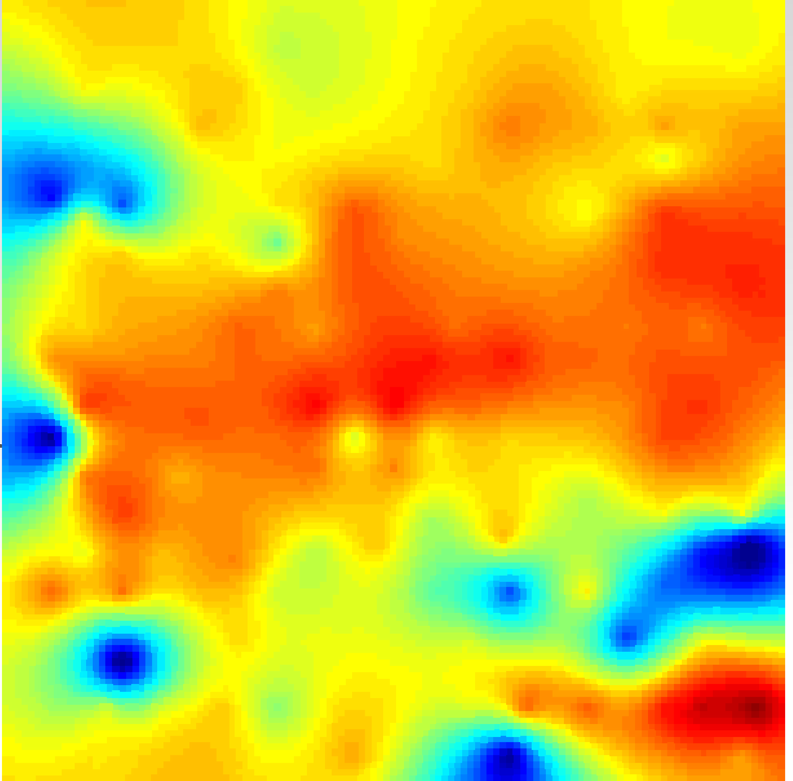

# GeoReVi
GeoReVi (Geological Reservoir Virtualization) is an open-source data management and analysis tool for subsurface applications. The software is intended to be used for reservoir data collection, data processing, data curation, data visualization and eventually for reservoir characterization. Data is stored in a local or server database dependent on the specific needs. The software runs on all Windows systems.

## License

This project is licensed under the GNU General Public License v3.0 License - see the [LICENSE.md](LICENSE.md) file for details

The LOCAL ONLY version of the software is freely available. To setup a multi-user-environment you have to change the section including the connection string in your GeoReVi.config.xml file in the installation folder to the according database. However, you need a properly structured database with many stored procedures. Concact us under contact@georevi.com for more information.

## Requirements
OS: Windows 7 - 10

## Built With
* [Windows Presentation Foundation](https://docs.microsoft.com/de-de/dotnet/framework/wpf/) - Main application framework
* [Entity framework](https://docs.microsoft.com/de-de/ef/) - The database framework used
* [HelixToolkit](https://github.com/helix-toolkit/helix-toolkit}{HelixToolkit.WPF) - 3D visualization
* [Managed Extensibility Framework](https://docs.microsoft.com/de-de/dotnet/framework/mef/) - Modular development
* [Accord.NET](http://accord-framework.net) - Linear Algebra and Machine Learning helper
* [Caliburn.Micro](https://caliburnmicro.com/) - Awesome MVVM development framework
* [FontAwesomeWPF](https://github.com/charri/Font-Awesome-WPF/) - Icon provider
* [LiteDB](https://www.litedb.org/) - Embedded NoSQL database
* [GeoAPI](https://github.com/NetTopologySuite/GeoAPI) - Coordinate conversion and projection framework
* [MoreLinq](https://morelinq.github.io) - Helpful Query Framework
* [Extended WPF Toolkit™](https://github.com/xceedsoftware/wpftoolkit) - Providing nice UI controls like the AvalonDock

## Getting started
To get started with GeoReVi you have to download the installer file (GeoReVi.exe) in the docs folder and run the installation. Tutorials can be found in the user manual. Exemplary datasets and samples are provided in the docs folders.

## Contributing
Individual view-models and views can be developed and integrated into GeoReVi.

If bugs or any other issues are identified we would be grateful for reporting those in the [Issues](https://github.com/ApirsAL/GeoReVi/issues).

## Authors

* **Adrian Linsel** - *Initial work* - [ApirsAL](https://github.com/ApirsAL) - contact@georevi.com

## Acknowledgments

* Thanks go to all the people that contributed to the test datasets of GeoReVi!

## Samples

### Reservoir scale thermal conductivity distribution

### Meter-scale permeability distribution

### Three-dimensional Principal Component Analysis

